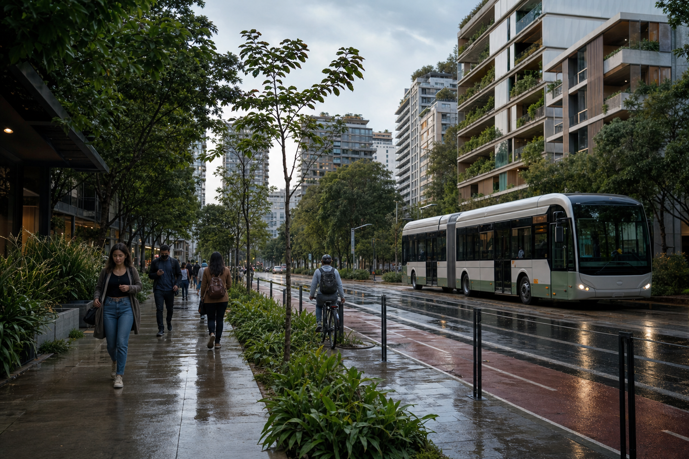

# São Paulo 2045: Natty ou IA? 🌿🏙️

> **Aviso de transparência:** a imagem apresentada neste projeto é fictícia e foi
> gerada por inteligência artificial. Ela não registra um lugar ou acontecimento real.

## 📒 Descrição

Este projeto imagina como poderia ser um bairro sustentável de São Paulo em
2045. A proposta foi criar uma cena tão plausível quanto uma fotografia
documental: transporte elétrico, ciclovia protegida, edifícios com vegetação e
pessoas vivendo uma manhã comum depois da chuva.

O desafio não foi criar um futuro espetacular, mas um futuro próximo que
parecesse possível — o bastante para provocar a pergunta: **é natural ou foi
gerado por IA?**

## 🤖 Tecnologias Utilizadas

- **OpenAI Codex:** definição do conceito, engenharia de prompt e documentação;
- **OpenAI Image Generation:** geração da imagem fotorrealista;
- **Git e GitHub:** versionamento e publicação do projeto.

## 🧐 Processo de Criação

1. Escolhi um cenário urbano brasileiro reconhecível, sem reproduzir um local
   específico.
2. Troquei elementos exagerados de ficção científica por mudanças plausíveis,
   como ônibus elétrico, telhados verdes e infraestrutura cicloviária.
3. Estruturei o prompt com linguagem fotográfica: lente de 35 mm, luz difusa,
   asfalto molhado, cores naturais, textura de pele e pequenas imperfeições.
4. Pedi que marcas, textos, logotipos e estética *cyberpunk* fossem evitados.
5. Revisei o resultado procurando inconsistências visuais e deixei explícito
   que a cena foi criada por IA.

O [prompt completo](./PROMPT.md) também está disponível no repositório para
permitir que o experimento seja estudado e reproduzido.

## 🚀 Resultados

*Cena fictícia de uma São Paulo sustentável em 2045 — imagem gerada por IA.*

A iluminação nublada, os reflexos no asfalto e as pessoas em atividades comuns
ajudam a criar uma sensação documental. Em contraste, a integração quase ideal
entre vegetação, mobilidade e arquitetura pode levantar suspeitas de que a cena
foi construída artificialmente.

## 💭 Reflexão

Criar algo “natty” com IA não depende apenas de adicionar mais detalhes. Quanto
mais perfeita e espetacular a imagem fica, mais artificial ela pode parecer.
Pequenas imperfeições, iluminação coerente e situações cotidianas foram mais
importantes para o realismo do que uma estética futurista.

O experimento também reforçou uma responsabilidade essencial: uma imagem
convincente deve ser identificada como conteúdo gerado por IA para não ser
confundida com um registro verdadeiro.

---

Projeto desenvolvido para o desafio **Lab Natty or Not**, da DIO.
